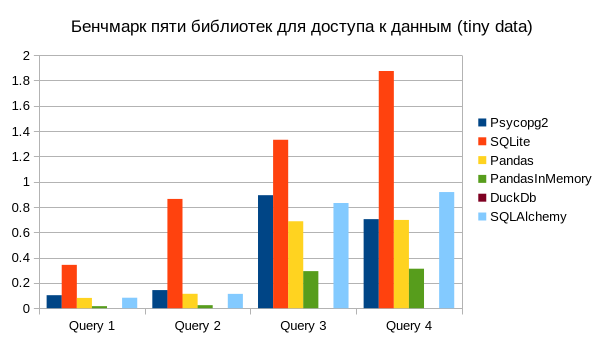
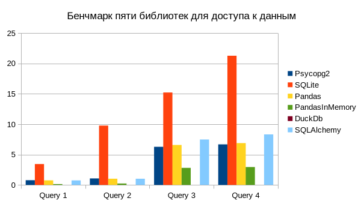

# Лабораторная по замеру производительности пяти библиотек для доступа к данным

## О бенчмарке
Данный бенчмарк измеряет производительность следующих Python библиотек.
- Psycopg2
- SQLite
- Pandas (in-memory и с Postgres)
- SQLAlchemy
- DuckDB

Было проведено 4 запроса разного уровня сложности.
Замеры были произведены на 2 датасетах (200 Мб и 2 Гб).
Конфигурация проекта изменяется в файле [config.json](config.json)

## Описание конфигурации
На выбор предоставлены следующие параметры:

| Параметр     | Описание                                                                                                    | Значение по умолчанию |
|--------------|-------------------------------------------------------------------------------------------------------------|-----------------------|
| tests_count  | Количество производимых тестов                                                                              | 10                    |
| dataset_path | Путь к файлу с датасетом                                                                                    | ***'./tiny.csv'***    |
| table_name   | Название базы данных, которая будет сгенерирована в БД                                                      | **taxi_db**           |
| run          | Словарь, где каждый ключ - доступная для теста библиотека, значение - вкл/выкл ли тесты для этой библиотеки | ***True*** для всех   |

## Запуск бенчмарка

Для запуска бенчмарка нужно:
1. Поправить конфигурационный файл по своему предпочтению
2. Создать виртуальное окружение, к примеру с помощью **venv** `python -m venv /path/to/new/virtual/environment`
3. В этом виртуальном окружении установить зависимости `pip install .`
4. Запустить сам бенчмарк `python main.py`

> [!CAUTION]
> Данный бенчмарк не работает с Python версии 3.12

## Результаты

```
Python 3.11.6, Arch Linux
AMD Ryzen 9 5980HX with Radeon Graphics, 1 CPU, 16 logical and 8 physical cores
```

### Для малого датасета (200 Мб)

|         | Psycopg2     | SQLite       | Pandas       | PandasInMemory | DuckDb       | SQLAlchemy   |
|---------|--------------|--------------|--------------|----------------|--------------|--------------|
| Query 1 | 0.102946168  | 0.3427494014 | 0.0812947722 | 0.0161863241   | 7.12E-05     | 0.0827625092 |
| Query 2 | 0.1432539555 | 0.8637760267 | 0.1138774252 | 0.0240327028   | 5.67E-05     | 0.1133998805 |
| Query 3 | 0.8933530269 | 1.3316938899 | 0.6870747341 | 0.2929921696   | 9.26E-05     | 0.8313035968 |
| Query 4 | 0.7038060432 | 1.8749551165 | 0.697580966  | 0.3121288295   | 0.0001044401 | 0.9181180308 |



### Для большого датасета (2 Гб)

|         | Psycopg2     | SQLite        | Pandas       | PandasInMemory | DuckDb       | SQLAlchemy   |
|---------|--------------|---------------|--------------|----------------|--------------|--------------|
| Query 1 | 0.7779577387 | 3.4342247053  | 0.7551339586 | 0.1395014033   | 7.98E-05     | 0.7491746789 |
| Query 2 | 1.0693977737 | 9.7683341692  | 1.0222808105 | 0.2358743993   | 5.62E-05     | 1.0186056987 |
| Query 3 | 6.2766681088 | 15.2229001093 | 6.5825045595 | 2.810384272    | 0.0007079783 | 7.4830037289 |
| Query 4 | 6.6785804089 | 21.2715997532 | 6.8831326099 | 2.9446209036   | 0.0001644061 | 8.3195714676 |



## Выводы